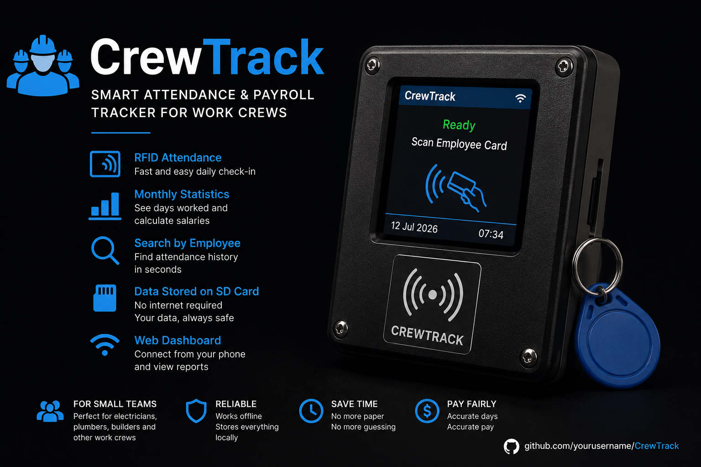

<p align="center">
  
</p>

<p align="center">
  
  
  
  
  
</p>

<h1 align="center">CrewTrack</h1>

<p align="center">
  <b>Open Source RFID Attendance System for Small Work Crews</b><br>
  <sub>For electricians, plumbers, HVAC techs, painters, builders, and any crew with 2-20 workers</sub>
</p>

---

## Status

🚧 **Under active development**

| Component | Status |
|-----------|--------|
| RFID scanning | ✅ Working |
| LCD display | ✅ Working |
| SD card logging | ✅ Working |
| WiFi dashboard | ✅ Working |
| Employee management | ✅ Working |
| Salary calculator | ✅ Working |
| CSV export | ✅ Working |
| Hardware integration | 🔄 Testing |
| GPS tracking | 🔲 Planned |
| Mobile app | 🔲 Planned |

> The firmware and dashboard are fully implemented. Hardware integration is being tested and debugged. See [Roadmap](#roadmap) for details.

---

## The Problem

> *"How many days did George work this month?"*
> *"Did Nikos work 8 or 10 days?"*
> *"How much should I pay Kostas?"*

Small businesses with temporary workers track attendance on paper or from memory. At month-end, nobody remembers the exact numbers.

## The Solution

**CrewTrack** is a standalone device. Every assistant has an RFID card. Every morning, tap each card before leaving for work. The device handles the rest.

```
┌─────────────────────────────┐
│         CREWTRACK           │
│                             │
│            OK               │
│                             │
│          George             │
│     Attendance Saved        │
│                             │
│     12 Jul 2026  07:34      │
└─────────────────────────────┘
```

---

## Features

| Feature | Description |
|---------|-------------|
| **RFID Tap-In** | Workers tap their card. Attendance logged instantly. |
| **Duplicate Detection** | Won't double-count same-day scans. |
| **Unknown Card Alert** | Flags unregistered cards immediately. |
| **LCD Display** | 2" ST7789 shows scan results in real-time. |
| **Audio Feedback** | Buzzer confirms each scan. |
| **SD Card Storage** | One CSV file per day. No internet required. |
| **WiFi Dashboard** | Connect your phone to manage everything. |
| **Employee Management** | Add, edit, delete employees from your phone. |
| **Monthly Salary** | Days worked × daily wage. Automatic. |
| **CSV Export** | Download full attendance history. |
| **Search & Filter** | Find any worker by name or UID. |
| **NTP Time Sync** | Accurate timestamps without RTC module. |

---

## Hardware

Total cost: **~€15**

| Component | Model | Cost |
|-----------|-------|------|
| Microcontroller | ESP32 DevKit V1 | €3-5 |
| RFID Reader | RC522 MFRC522 | €2-3 |
| Display | ST7789V 2" IPS LCD | €4-6 |
| Storage | MicroSD Module | €1-2 |
| Feedback | Active Buzzer 5V | €0.50 |
| Cards | MIFARE Classic 1K | €0.10 each |

See [BOM.md](BOM.md) for full shopping list with links.

---

## Wiring

```
                    ESP32
                 ┌──────────┐
    SCK  ────────┤ GPIO 18  ├──────┐
    MISO ────────┤ GPIO 19  ├──────┤ Shared SPI Bus
    MOSI ────────┤ GPIO 23  ├──────┘
                 │          │
    RFID SS ─────┤ GPIO  5  │
    RFID RST ────┤ GPIO 22  │
                 │          │
    LCD CS  ─────┤ GPIO 15  │
    LCD DC  ─────┤ GPIO  2  │
    LCD RST ─────┤ GPIO  4  │
                 │          │
    SD CS   ─────┤ GPIO 10  │
                 │          │
    Buzzer  ─────┤ GPIO 25  │
                 └──────────┘
```

| Module Pin | ESP32 |
|------------|-------|
| **RFID RC522** | |
| SDA (SS) | GPIO 5 |
| SCK | GPIO 18 |
| MOSI | GPIO 23 |
| MISO | GPIO 19 |
| RST | GPIO 22 |
| 3.3V / GND | 3.3V / GND |
| **ST7789V LCD** | |
| SCL (CLK) | GPIO 18 |
| SDA (MOSI) | GPIO 23 |
| CS | GPIO 15 |
| DC | GPIO 2 |
| RST | GPIO 4 |
| VCC / BL | 3.3V |
| **MicroSD** | |
| CLK | GPIO 18 |
| MOSI | GPIO 23 |
| MISO | GPIO 19 |
| CS | GPIO 10 |
| VCC / GND | 3.3V / GND |
| **Buzzer** | |
| + / - | GPIO 25 / GND |

---

## Quick Start

### 1. Install Arduino IDE
Download from [arduino.cc](https://www.arduino.cc/en/software)

### 2. Install ESP32 Board
**File > Preferences** → Additional Boards URL:
```
https://raw.githubusercontent.com/espressif/arduino-esp32/gh-pages/package_esp32_index.json
```
**Tools > Board > Boards Manager** → Search "esp32" → Install

### 3. Install Libraries
**Sketch > Include Library > Manage Libraries**:
- `MFRC522` by miguelbalboa
- `TFT_eSPI` by bodmer
- `ArduinoJson` by Benoit Blanchon

### 4. Configure TFT_eSPI
Copy contents of `TFT_eSPI_User_Setup.h` into your TFT_eSPI library's `User_Setup.h`:
```
Windows: C:\Users\<you>\Documents\Arduino\libraries\TFT_eSPI\User_Setup.h
Mac:     ~/Documents/Arduino/libraries/TFT_eSPI/User_Setup.h
```

### 5. Upload
Open `CrewTrack.ino` → **ESP32 Dev Module** → Upload

### 6. Connect
1. Power on device
2. Connect phone to WiFi: **`CrewTrack`** / **`12345678`**
3. Open browser: **`192.168.4.1`**
4. Add employees, scan cards, done

---

## Web Dashboard

Connect to the device's WiFi and open `192.168.4.1`:

```
┌──────────────────────────────────────────┐
│              CREWTRACK                   │
├──────────────────────────────────────────┤
│  [Dashboard] [Workers] [Attendance]      │
│  [Salary]    [+ Add]                     │
│                                          │
│  ┌──────┐  ┌──────┐  ┌──────┐           │
│  │  3   │  │  5   │  │07:36 │           │
│  │Today │  │ Empl │  │Last  │           │
│  └──────┘  └──────┘  └──────┘           │
│                                          │
│  Recent Scans                            │
│  George    E4913A21         07:34        │
│  Nikos     AABBCCDD         07:36        │
│  John      11223344         07:40        │
│                                          │
│  [Download CSV]                          │
└──────────────────────────────────────────┘
```

**Dashboard tabs:**
- **Dashboard** — Today's stats, recent scans
- **Workers** — All employees, searchable
- **Attendance** — Full scan history
- **Salary** — Monthly report with progress bars
- **+ Add** — Register new employees

---

## Roadmap

### ✅ Completed
- RFID card scanning with RC522
- ST7789V LCD display (4 screens)
- SD card CSV logging
- Buzzer audio feedback
- WiFi AP + web dashboard
- Employee CRUD (add/edit/delete)
- Monthly salary calculation
- CSV export
- Duplicate scan detection
- Search & filter workers
- NTP time synchronization

### 🔄 In Progress
- Hardware integration testing
- Reliable SD card detection
- Power management (car USB / battery)
- Enclosure design

### 🔲 Planned
- GPS tracking (GY-NEO6MV2)
- RTC module for offline time
- Multiple vehicle support
- Cloud backup
- Mobile app (React Native)
- Admin login / password protection
- PDF report generation
- OTA firmware updates
- Multi-language support

---

## Project Structure

```
CrewTrack/
├── CrewTrack.ino              Firmware (single file, Arduino IDE)
├── TFT_eSPI_User_Setup.h      Copy to TFT_eSPI library folder
├── employees_example.json     Example employee data for SD card
├── CrewTrack.png              Project banner
├── index.html                 Landing page (GitHub Pages)
├── README.md                  This file
├── LICENSE                    MIT License
├── CONTRIBUTING.md            How to contribute
├── CHANGELOG.md               Version history
├── BOM.md                     Shopping list with links
└── .github/
    ├── ISSUE_TEMPLATE/        Bug report & feature request forms
    └── workflows/
        └── compile.yml        CI - compiles on every push
```

---

## How It Works

```
  ┌──────────┐     ┌──────────┐     ┌──────────┐
  │ Employee │────▶│  RFID    │────▶│  ESP32   │
  │ taps card│     │  RC522   │     │          │
  └──────────┘     └──────────┘     └────┬─────┘
                                         │
                    ┌────────────────────┤
                    │                    │
                    ▼                    ▼
              ┌──────────┐        ┌──────────┐
              │   LCD    │        │ SD Card  │
              │ Display  │        │  Log CSV │
              └──────────┘        └──────────┘
                    │
                    ▼
              ┌──────────┐        ┌──────────┐
              │  Buzzer  │        │  WiFi    │
              │  Beep!   │        │Dashboard │
              └──────────┘        └──────────┘
```

---

## Contributing

Contributions welcome! See [CONTRIBUTING.md](CONTRIBUTING.md) for guidelines.

**Ways to help:**
- Report bugs → [Issues](https://github.com/0x-Shadow/CrewTrack/issues)
- Suggest features → [Issues](https://github.com/0x-Shadow/CrewTrack/issues)
- Fix bugs → Pull Request
- Improve docs → Pull Request
- Test hardware → Share results
- Design enclosure → 3D printable case

---

## License

[MIT License](LICENSE) — Free for personal and commercial use.

---

<p align="center">
  Built with ESP32 + Arduino<br>
  <sub>Star this repo if it helps your business ⭐</sub>
</p>
